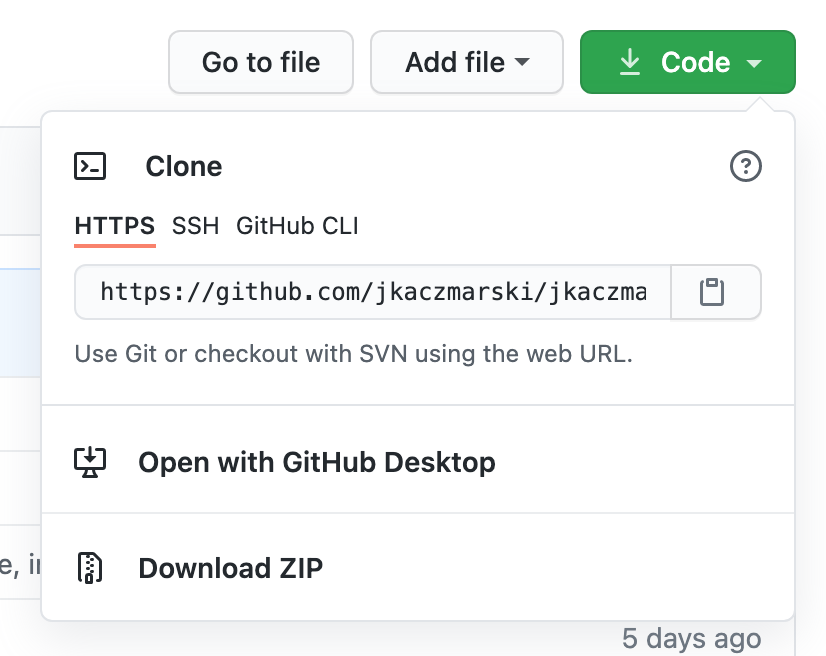

_**Want to make your own website just like this one? In this post, I take you through the steps I used to create this site so you can make one too!**_

I am very grateful to these pages, which helped me a lot during the set up of my site. You should check them out too!  
- <a href="https://github.com/daattali/beautiful-jekyll" target="_blank">Beautiful Jekyll on Github</a>  
- <a href="https://maximevaillancourt.com/blog/setting-up-your-own-digital-garden-with-jekyll" target="_blank">Maxime Vaillancourt's great post on setting up a digital garden with jekyll</a>. (If you're into digital gardens, you should definitely check out Maxime's digital garden template.)

# Ok, let's get started.. 
 
## 1. Install Dependencies

First, you'll need a few things to get started. Go ahead and install the following:
- <a href="https://www.ruby-lang.org/en/" target="_blank">Ruby</a>  
- <a href="https://rubygems.org/" target="_blank">Ruby Gems</a>  
- <a href="https://git-scm.com/downloads" target="_blank">Git</a>  

(while you're at it, you may want to install a decent text editor - my current choice is <a href="https://atom.io/" target="_blank">Atom</a>)

## Create your own accounts on: 
- <a href="https://github.com/join" target="_blank">GitHub</a> 
- <a href="https://app.netlify.com/signup" target="_blank">Netlify</a> 

## Create a fork of the template (beautiful-jekyll)

The theme that I am using as a base for this site is called "Beautiful-Jekyll". You can download it from GitHub:  
- Go to <a href="https://github.com/daattali/beautiful-jekyll" target="_blank">Beautiful-Jekyll on Github</a> and create a fork to copy it into your own GitHub account: 

- Now, go to your GitHub page for your new repository (fork) and click on the "Code" button and copy the URL:
  
	 

## Make a local clone of your repository
We want to have a copy all the files for your website kept on your local computer. To do this, open a new Terminal window, move to the folder where you want to keep your website folder: e.g. `cd ~/` if you want to keep them in your home folder (Mac/Linux). 

Now copy your GitHub repository here by using:  
`git clone <YOUR_COPIED_URL_HERE> website`. 

You now have a local copy of your website files stored in the folder named "website". Move to this folder using `cd website`. 

## Let's test it out
Now that you are in the parent folder of your website, let's install the necessary dependencies like Jekyll by running: 
`bundle`

Now we can tell Jekyll to serve the site locally: 

`bundle exec jekyll serve`

Now, open your internet browser and go to http://localhost:4000. I recommend bookmarking this address in your bookmark bar for easy access later. Hopefully now you see a version of your very own website!!

## Connecting to Netlify
We will use Netlify to post your website to the internet every time you update your GitHub repository. 
- Login to Netlify
- Click "New site from Git"
- Approve, and then select your "beautiful-jekyll repository from the list"
- On the next page, click "Deploy site". 
- You can change the Netlify URL 

## Adding shortcuts to your .bashrc/.zshrc file
I like to add the following aliases (shortcuts to my .bashrc file). 

git add --all; git commit -m 'Update content'; git push origin master

## Notes 
You can use other templates. E.g. if you're into digital gardens, check out this awesome template from Maxime Vaillancourt. 
https://github.com/maximevaillancourt/digital-garden-jekyll-template

The beutiful-jekyll template has some nice examples of markdown files to edit and look at. See the README at https://github.com/daattali/beautiful-jekyll

## A few notes about YAML

## Editing the config file
- Connect your socials
- 

## SEO

## Installing jekyll plugins

- compose
- discuss

## Editing pages

## Making new pages and post drafts

## Mailing list 
- Mailchimp
- Contact form

## Improving your website
- Lighthouse tests
- TinyIMG
- Think about your audience
- Start writing
- Promote your website
- Image seo

